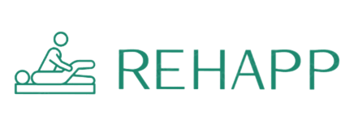

# Ombro Plus - Sistema para Reabilitação de Ombro

  

## 🎯 Sobre o Projeto

Ombro Plus é um aplicativo móvel desenvolvido para auxiliar pacientes no acompanhamento e reabilitação de lesões no ombro.

O projeto nasceu como um Trabalho de Conclusão de Curso (TCC) da FATEC Rio Preto, com o objetivo de facilitar a comunicação e o monitoramento entre fisioterapeutas (ou médicos) e seus pacientes, centralizando protocolos de exercícios, registro de atividades e acompanhamento de métricas de recuperação.

## ✨ Funcionalidades Principais

O aplicativo foi desenhado para atender tanto o paciente quanto o profissional de saúde, oferecendo:

*Para o Paciente*

- Protocolos de Exercícios: Visualização clara dos protocolos de reabilitação prescritos.
- Conteúdo Multimídia: Acesso a vídeos explicativos para a correta execução dos exercícios.
- Acompanhamento de Progresso: Telas de dashboard com gráficos para monitoramento de métricas e evolução.
- Comunicação Direta: Seção de chat para tirar dúvidas com o profissional de saúde.
- Formulários Clínicos: Preenchimento de informações clínicas e de dor para acompanhamento.

*Para o Profissional de Saúde*

- Gestão de Pacientes: Visualização e gerenciamento da lista de pacientes cadastrados.
- Criação de Protocolos: Ferramentas para criação e edição de novos protocolos de exercícios personalizados.
- Detalhes do Paciente: Acesso ao log de atividades e métricas de cada paciente.
- Envio de Convites: Tela para convidar novos pacientes.
- Feed dos acontecimentos: Sessão para o profissional acompanhar as atividades recentes dos pacientes.

## 💻Tecnologias Utilizadas

O projeto foi construído utilizando as seguintes tecnologias principais:

- Framework: Flutter (Mobile, iOS/Android)
- Linguagem: Dart
- Backend: Google Firebase
- Firestore: Base de dados NoSQL para armazenar protocolos, logs, perfis de usuário e feed de atividades.
- Firebase Authentication: Gestão de login, registro e diferenciação de papéis (Especialista vs. Paciente).
- Gráficos: fl_chart para renderização dos gráficos de progresso e adesão.
- Outros Pacotes: google_fonts, intl (para formatação em pt-BR), Youtubeer_flutter, etc.
